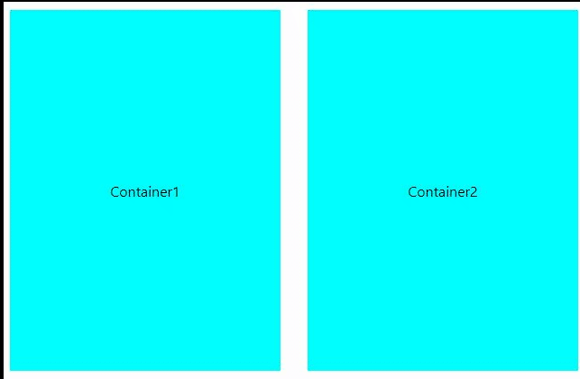

<!--Category:React--> 
 

    <a href="http://productivitytools.tech/example-react-context-menu/"><a> 
    

    

 
# Example - React - Context menu 

Example shows how to create right button menu - context menu. It is done in functional approach.

<!--more-->

Example is rewritten from https://nmingaleev.medium.com/how-to-create-a-custom-context-menu-with-react-hooks-30d011f205a0 

<!--og-image-->

